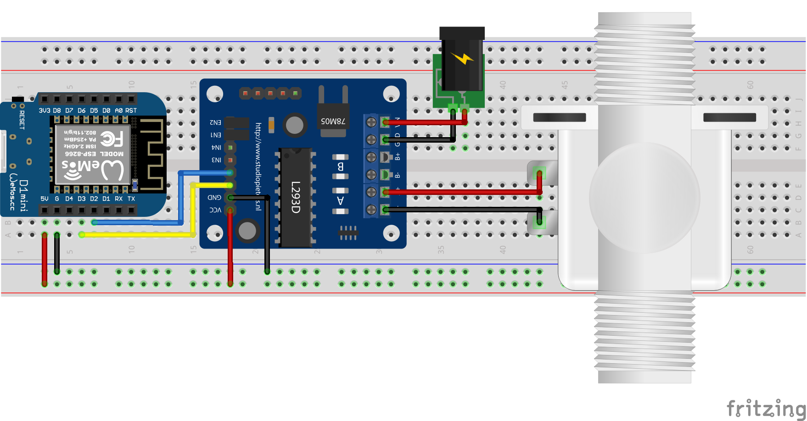

# Control a bistable valve using MQTT
## Overview
Mongoose-OS firmaware to control a bistable valve using MQTT protocol.
## Hardware
Bill of materials:
* Wemos D1 Mini board
* L293D Motor Driver board
* Bistable valve
* External power suply (for the valve)

</img>
## Firmware
Add these configurations to your `mos.yml` file.
```yaml
config_schema:
  - ["mqtt.server", "<your_mqtt_server_address>"]
  - ["mqtt.user", "<your_username>"]
  - ["mqtt.pass", "<your_password>"]

libs:
  - origin: https://github.com/mongoose-os-libs/boards
  - origin: https://github.com/mongoose-os-libs/wifi
  - origin: https://github.com/mongoose-os-libs/rpc-common
  - origin: https://github.com/mongoose-os-libs/rpc-uart
  - origin: https://github.com/mongoose-os-libs/rpc-service-config
  - origin: https://github.com/diy365-mgos/bvalve
  - origin: https://github.com/diy365-mgos/bvalve-gpio
  - origin: https://github.com/diy365-mgos/bthing-shadow
  - origin: https://github.com/diy365-mgos/bthing-mqtt
```
Copy and paste this firmware code into your `main.c` file.
```c
// coming soon
```
## MQTT
You can use MQTT */state/updated* and */state/set* topics for getting and setting the valve's state. In addition you can also use more [shadow topics](https://github.com/diy365-mgos/bthing-mqtt#shadow-mode-mqtt-topics).
### /state/updated
Subscribe to */state/updated* topic to receive valve's state updates.
```
$bthings/{device_id}/state/updated
```
[Shadow state document](https://github.com/diy365-mgos/bthing-mqtt#shadow-state-document-example) published on the */state/updated* topic. The `state_code` is one of the valve's [states](https://github.com/diy365-mgos/bvalve#mgos_bvalve_state).
```
{ "v01": <state_code> }
```
### /state/set
Publish a [Shadow state document](https://github.com/diy365-mgos/bthing-mqtt#shadow-state-document-example) to /state/set topic to set the valve's state.
```
$bthings/{device_id}/state/set
```
Open the valve.
```
{ "v01": 1 }
```
Close the valve.
```
{ "v01": 0 }
```