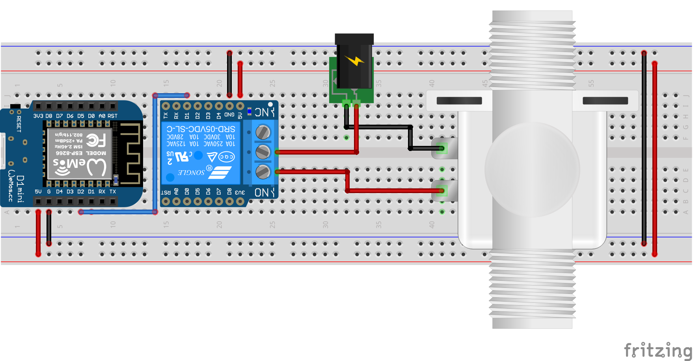

# Open and close a solenoid valve using MQTT
## Overview
Mongoose-OS firmaware to drive a solenoid valve using MQTT protocol.
## Hardware
Bill of materials:
* Wemos D1 Mini board
* Wemos relay board
* Solenoid valve
* External power suply (for the valve)

</img>
## Firmware
Add these configurations to your `mos.yml` file.
```yaml
config_schema:
  - ["mqtt.server", "<your_mqtt_server_address>"]
  - ["mqtt.user", "<your_username>"]
  - ["mqtt.pass", "<your_password>"]

libs:
  - origin: https://github.com/mongoose-os-libs/boards
  - origin: https://github.com/mongoose-os-libs/wifi
  - origin: https://github.com/mongoose-os-libs/rpc-common
  - origin: https://github.com/mongoose-os-libs/rpc-uart
  - origin: https://github.com/mongoose-os-libs/rpc-service-config
  - origin: https://github.com/diy365-mgos/bvalve
  - origin: https://github.com/diy365-mgos/bvalve-gpio
  - origin: https://github.com/diy365-mgos/bthing-shadow
  - origin: https://github.com/diy365-mgos/bthing-mqtt
```
Copy and paste this firmware code into your `main.c` file.
```c
#include "mgos.h"
#include "mgos_bvalve.h"
#include "mgos_bvalve_gpio.h"

static void valve_state_changed_cb(int ev, void *ev_data, void *userdata) {
  struct mgos_bthing_state* data = (struct mgos_bthing_state*)ev_data;

  char* str_state = NULL; 
  switch (mgos_bvar_get_integer(data->state))
  {
    case MGOS_BVALVE_STATE_UNKNOWN:
      str_state = "UNKNOWN";
      break;
    case MGOS_BVALVE_STATE_CLOSED:
      str_state = "CLOSED";
      break;
    case MGOS_BVALVE_STATE_OPEN:
      str_state = "OPEN";
      break;
    case MGOS_BVALVE_STATE_OPENING:
      str_state = "OPENING";
      break;
    case MGOS_BVALVE_STATE_CLOSING:
      str_state = "CLOSING";
      break;
    default:
      str_state = "ERROR";
      break;
  }

  LOG(LL_INFO, ("Valve '%s': %s", mgos_bthing_get_id(data->thing), str_state));
}

enum mgos_app_init_result mgos_app_init(void) {
  mgos_event_add_handler(MGOS_EV_BTHING_STATE_CHANGED, valve_state_changed_cb, NULL);

  // create the valve on pin 4 (D2 on Wemos board)
  mgos_bvalve_t v01 = mgos_bvalve_create("v01", (MGOS_BVALVE_TYPE_SOLENOID | MGOS_BVALVE_TYPE_NC), NULL);
  mgos_bvalve_gpio_attach(v01, 4, true);

  return MGOS_APP_INIT_SUCCESS;
}
```
## MQTT
You can use MQTT */state/updated* and */state/set* topics for getting and setting the valve's state. In addition you can also use more [shadow topics](https://github.com/diy365-mgos/bthing-mqtt#shadow-mode-mqtt-topics).
### /state/updated
Subscribe to */state/updated* topic to receive valve's state updates.
```
$bthings/{device_id}/state/updated
```
[Shadow state document](https://github.com/diy365-mgos/bthing-mqtt#shadow-state-document-example) published on the */state/updated* topic. The `state_code` is one of the valve's [states](https://github.com/diy365-mgos/bvalve#mgos_bvalve_state).
```
{ "v01": <state_code> }
```
### /state/set
Publish a [Shadow state document](https://github.com/diy365-mgos/bthing-mqtt#shadow-state-document-example) to /state/set topic to set the valve's state.
```
$bthings/{device_id}/state/set
```
Open the valve.
```
{ "v01": 1 }
```
Close the valve.
```
{ "v01": 0 }
```